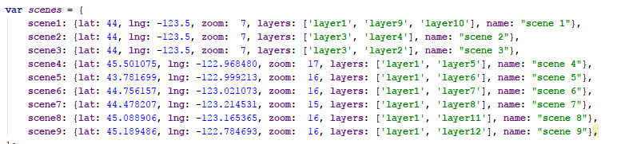
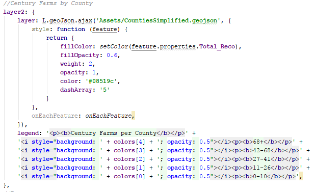
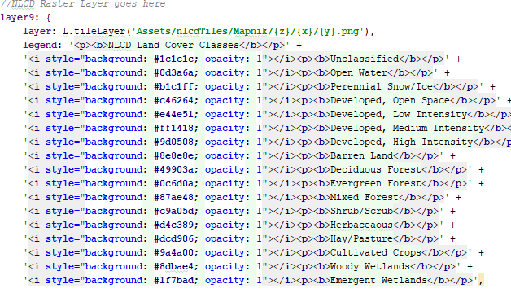
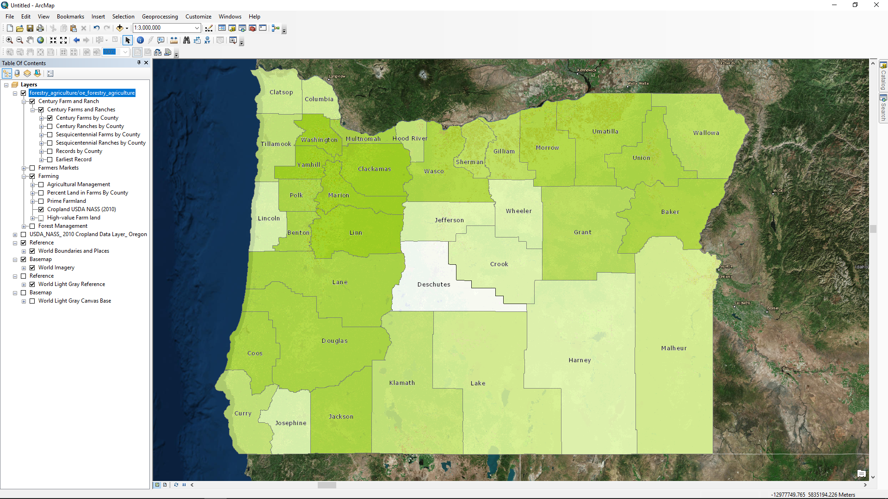
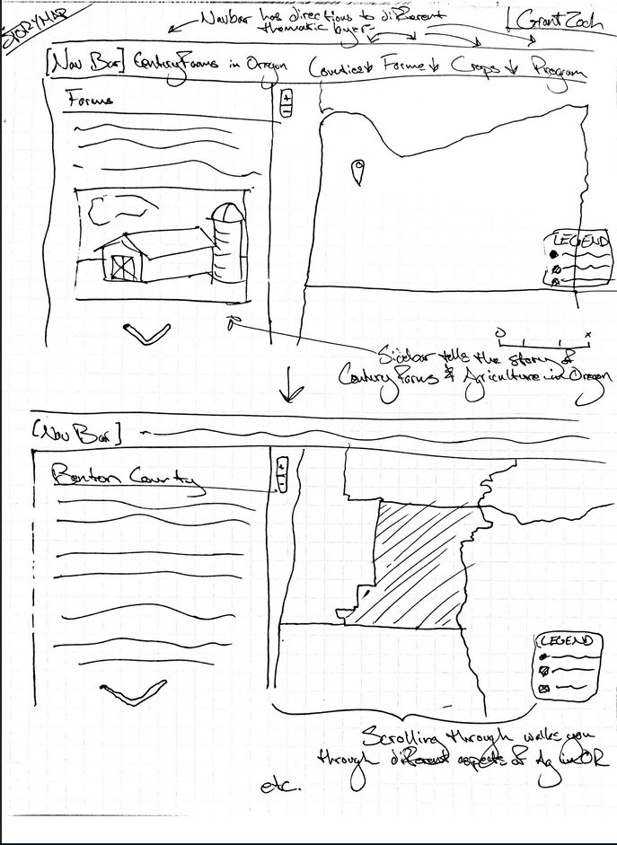

# Century Farms in Oregon

**Project Description and Goal**

For my story-mapping project, I have mapped several Century Farms in Oregon, as well as giving context as to the state of agriculture in Oregon and the farming infrastructure currently present. This was done so as to give an impression as to the importance of small-scale family-owned farms in Oregon's agricultural system. By understanding the scale and spatial extent of farms which have been in operation for over 100 years, I'm hoping to convey to the reader the history and importance of Oregon's agricultural heritage.

**Technical Summary**

System Architecture

The system architecture I have employed is the use of several spatial data files (primarily geoJSONs and a set of tiles) on the server side, along with narrative files, to be passed to the client via the geospatial and webserver.

Main Functions

The main function of my project is as a story map, using the base code provided by Bo Zhao.

Another important function was the display of a Century Farm geoJSON, seen below, which contained information on Century Farm density and location.

A third important function was the display of NLCD land cover data, a raster dataset that had to been converted to a tile set using QTiles. 

**Reflection**

This was an incredibly difficult process. I'm not very good at coding and also not very creative -- being able to try and get out of my comfort zone and do a lot of self-teaching and problem-solving was really important to finishing this project, and not always successful. Also, I had difficulty finding and using the right data. Turns out publicly available data isn't always of the highest quality, and I think my project suffered because of that. Picking a topic with more easily available and higher quality data would've made the project much better, in my opinion.

**Audience**

I feel that this project could be of use to policy makers interested in
keeping family farms running, instead of being sold to large corporate
interests which homogenize and consolidate the industry, reducing the number of
jobs and creating possibilities for large-scale failure. By understanding when
and where family farms were created in Oregon, and by understanding when they
began to disappear and where, it may be possible to prevent further dissolution
of family farms

**Data Sources**

- Oregon Spatial Data Library
- Data.gov
- Oregon Explorer
- Oregon Department of Agriculture
- ESRI
- USDA
- Mapbox

**Data Tables**

| Name                      | Description                              | URL                                      | Notes                                    |
| ------------------------- | ---------------------------------------- | ---------------------------------------- | ---------------------------------------- |
| Century Farms database    | Characteristics of each Century Farm     | http://ocfrp.library.oregonstate.edu/public/farms | Info on each Century farm and ranch      |
| USDA Croplands            | Raster data layer of the crop types in OR | https://databasin.org/datasets/41eabb1b38814d0abb22da5beeacbf57 |                                          |
| Century Farms Webpage     | Info on the program                      | http://oregonfb.org/centuryfarm/         |                                          |
| Century Farms Data Layers | Layers for century farms/ranches         | http://lib-arcgis5.library.oregonstate.edu/arcgis/rest/services/forestry_agriculture/oe_forestry_agriculture/MapServer | Look under the century farm and ranch list header |

**Libraries**

- [jQuery](https://cdnjs.cloudflare.com/ajax/libs/jquery/3.2.1/jquery.min.js)
- [Bootstrap](https://cdnjs.cloudflare.com/ajax/libs/twitter-bootstrap/3.3.7/js/bootstrap.min.js)
- [Leaflet](https://cdnjs.cloudflare.com/ajax/libs/leaflet/1.2.0/leaflet.j)
- [Font Awesome](https://cdnjs.cloudflare.com/ajax/libs/font-awesome/4.7.0/css/font-awesome.min.css)
- [Chroma] (https://cdnjs.cloudflare.com/ajax/libs/chroma-js/1.3.4/chroma.min.js)
- [Google Fonts] (https://fonts.googleapis.com/css?family=Raleway)
- Story Map Plugin

**Credit and Acknowledgements**

storymap.js | Released Date: 02/20/2017 | Version: 2.1 | MIT License

The Background video on the front page was clipped from [Youtube](https://www.youtube.com/watch?v=GshpFSwoNb4)

This story map uses geospatial data from mapbox, ESRI Map, the USDA, the Oregon Department of Agriculture, Oregon Explorer, and github.

Century Farm information can be found [here](http://oregonfb.org/wp-content/uploads/2017/08/2017_family_arratives.pdf) and [here](http://oregonfb.org/wp-content/uploads/2016/08/082016cfr.pdf)

Agricultural information can be found at the [Oregon Department of Agriculture](http://www.oregon.gov/ODA/shared/Documents/Publications/Administration/ORAgFactsFigures.pdf)

I would also like to thank Bo Zhao for his instruction and help throughout the course! 

**Screencap of Data Layers**

**Interface Sketch**

)
